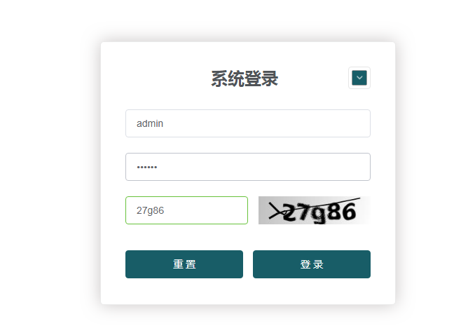
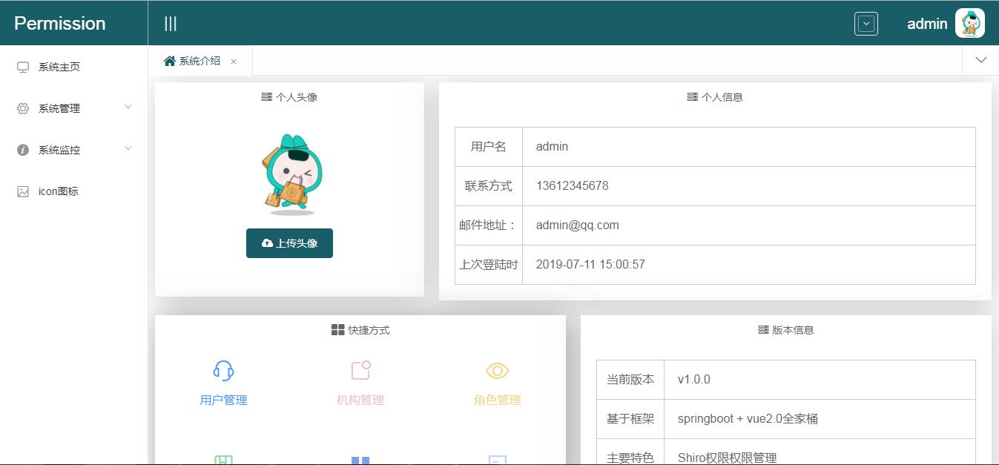
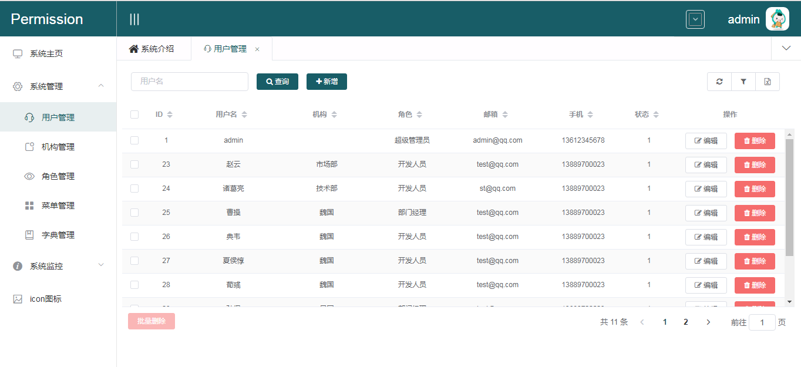
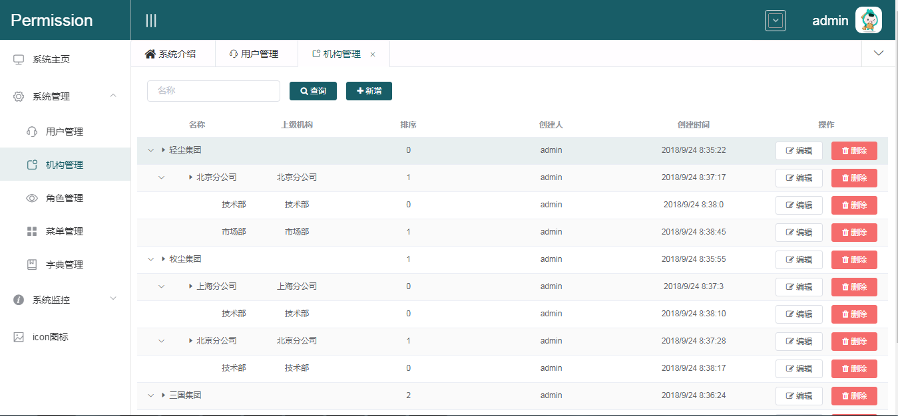
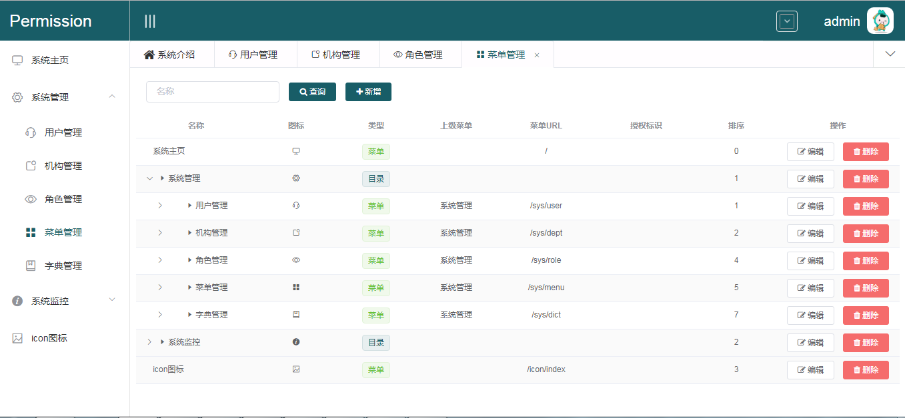
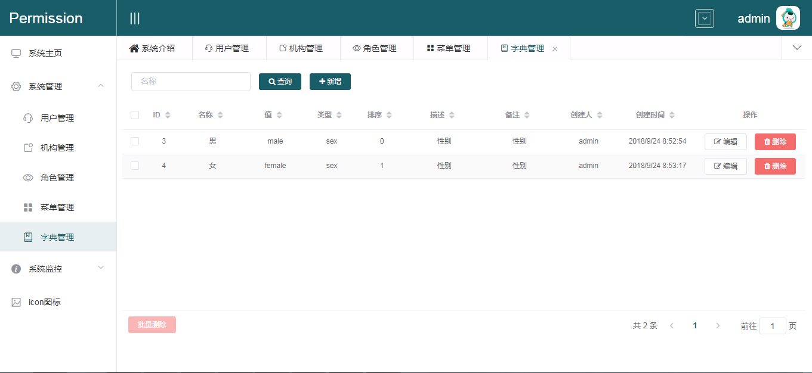
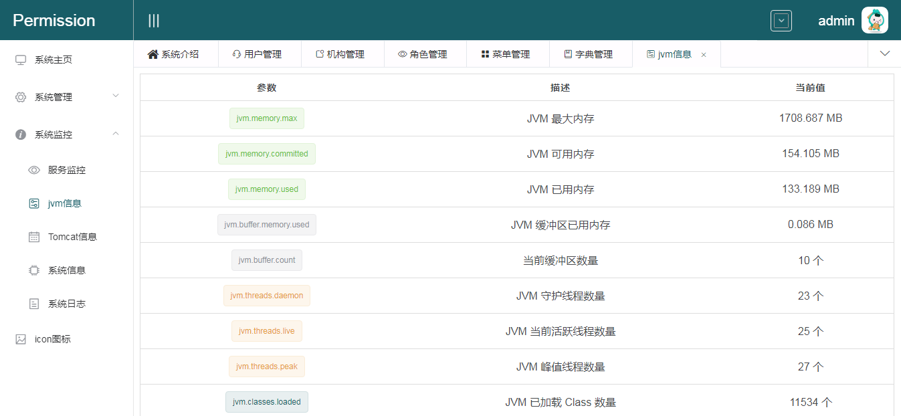
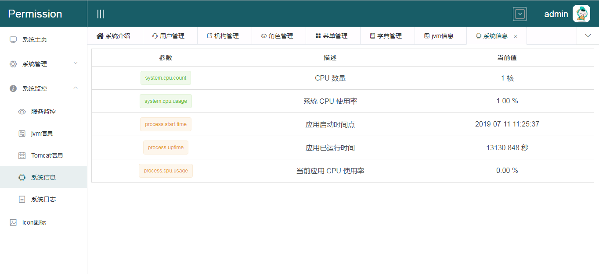
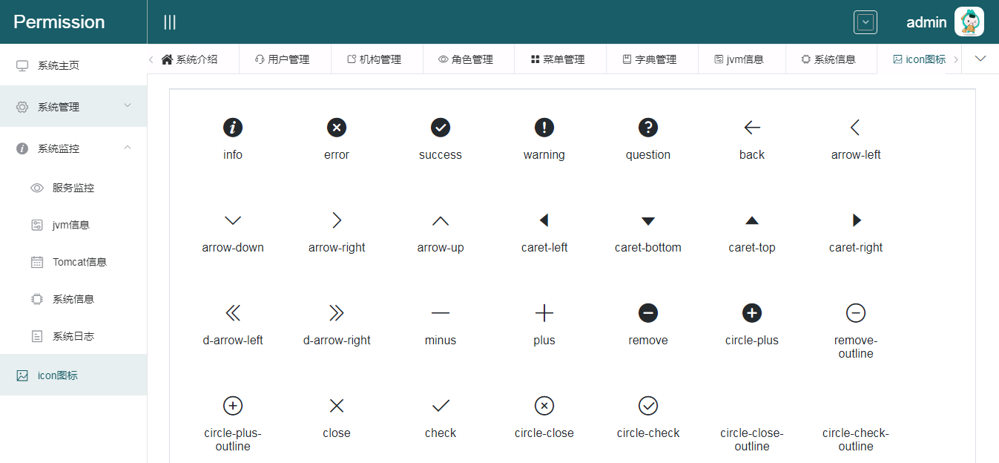

## permission（后端）


### 简介
permission是一款前后端分离的后台权限管理系统，基于Spring Boot, Shiro, Vue, Element实现，是我学习Shiro时的练手项目。

### 项目源码

|        | 后端源码                                                     | 前端源码                                                     |
| ------ | ------------------------------------------------------------ | ------------------------------------------------------------ |
| github | [https://github.com/goufaning/permission]([https://github.com/goufaning/permission) | [https://github.com/goufaning/permission-app](https://github.com/goufaning/permission-app) |

### 演示地址

[http://123.206.82.234/#/login](http://123.206.82.234/#/login)

用户名：admin 密码：123456

### 使用教程

#### 后端

1. 下载源码

   ```shell
   git clone https://github.com/goufaning/permission.git
   ```

2. IDEA 安装lombok插件

3. 新建MySQL（版本5.7.x）数据库，导入[SQL](https://github.com/goufaning/permission/tree/master/sql.table.sql)文件

4. IDEA导入项目

5. 修改数据库配置，等待Maven下载依赖

6. 启动项目

#### 前端

1. 下载源码

   ```shell
   git clone https://github.com/goufaning/permission-app.git
   ```

2. 安装node.js

3. 进入项目根目录，执行` npm install`, 下载和安装项目相关依赖包

4. 执行 `npm run dev `命令，启动项目，通过 [http://localhost:8090](http://localhost:8090/) 访问。
### 功能列表

* 系统登录：系统用户登录，系统登录认证（token方式）
* 用户管理：新建用户，修改用户，删除用户，查询用户
* 机构管理：新建机构，修改机构，删除机构，查询机构
* 角色管理：新建角色，修改角色，删除角色，查询角色
* 菜单管理：新建菜单，修改菜单，删除菜单，查询菜单
* 字典管理：新建字典，修改字典，删除字典，查询字典
* 系统日志：记录用户操作日志，查看系统执行日志记录
* 系统信息：查看JVM, TOMCAT, 服务器信息

### 技术选型

#### 后端

- [Spring Boot 2.1.0](http://spring.io/projects/spring-boot/)
- [Mybatis-Plus](https://mp.baomidou.com/guide/)
- [MySQL 5.7](https://dev.mysql.com/downloads/mysql/5.7.html#downloads)
- [Shiro](http://shiro.apache.org/)
- [JWT](https://jwt.io/)

####  前端

- [Vue 2.5.2](https://cn.vuejs.org/),[Vuex](https://vuex.vuejs.org/zh/),[Vue Router](https://router.vuejs.org/zh/)
- [Axios](https://github.com/axios/axios)
- [ElementUI](https://element.eleme.cn/)

### 系统展示



















### 鸣谢

感谢以下优秀开源项目

- 前端项目主要参考[https://gitee.com/liuge1988/kitty-ui](https://gitee.com/liuge1988/kitty-ui),并推荐作者的vue教程[https://www.cnblogs.com/xifengxiaoma/p/9533018.html](https://www.cnblogs.com/xifengxiaoma/p/9533018.html)
- [https://github.com/wuyouzhuguli/FEBS-Vue](https://github.com/wuyouzhuguli/FEBS-Vue)

